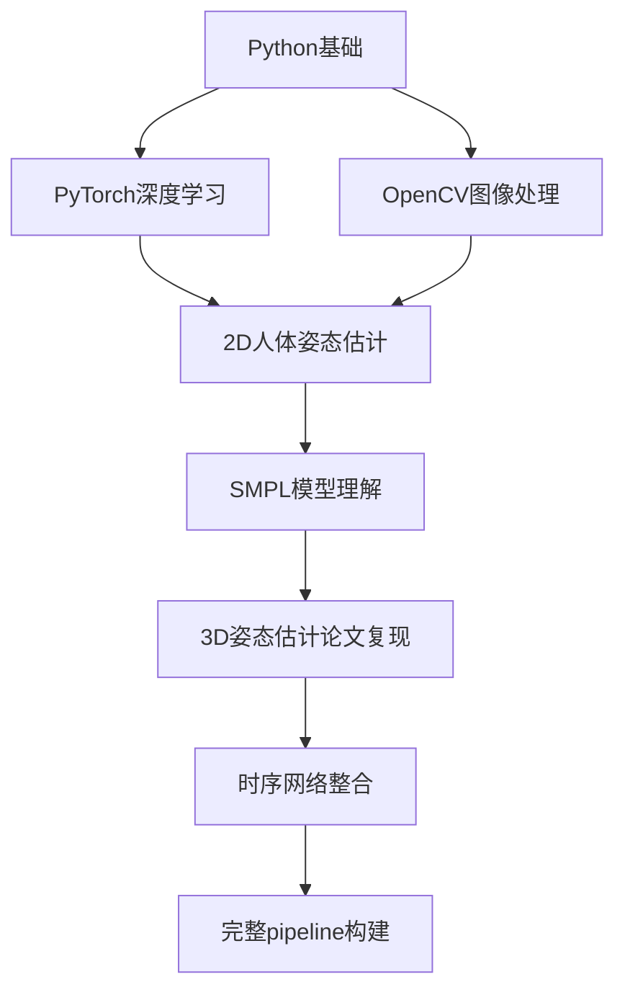

这是一个非常专业的 **「单目视频3D人体运动重建」** 赛道，属于计算机视觉和图形学的交叉领域。要参加这个比赛，你需要学习以下知识体系：

---

## 🧠 一、核心技术领域

### 1. **3D人体姿态估计**
- **基础概念**：从2D图像/视频估计3D人体关节位置
- **关键论文**：
  - 《VIBE: Video Inference for Human Body Pose and Shape Estimation》
  - 《ROMP: Real-time Optimization of Meshes and Poses》
  - 《PARE: Part Attention Regressor for 3D Human Body Estimation》

### 2. **人体模型表示**
- **SMPL/SMPL-X模型**：
  - 这是赛题要求的输出格式
  - 学习SMPL参数：姿态参数、形状参数、全局平移
  - 官方资源：[SMPL官网](https://smpl.is.tue.mpg.de/)

### 3. **时序运动重建**
- 处理视频序列，保证动作的平滑性和物理合理性
- 方法：RNN、LSTM、Transformer、TCN时序网络

---

## 📚 二、具体技术栈

### 必须掌握的技术：
| 领域 | 具体内容 | 推荐资源 |
|------|----------|----------|
| 深度学习框架 | **PyTorch**（主流选择） | PyTorch官方教程 |
| 计算机视觉 | 2D姿态估计、目标检测 | OpenPose、MMPose |
| 3D图形基础 | 坐标系变换、相机模型 | 《Multiple View Geometry》 |
| 人体建模 | SMPL/SMPL-X模型 | SMPL官方文档 |

---

## 🛠️ 三、针对赛题的专项学习

### 数据集研究：
- **AMASS**：最大的3D人体运动数据集
- **3DPW**：真实世界的3D姿态数据集  
- **Human3.6M**：学术基准数据集
- **InstaVariety**：野外视频数据

### 关键技术点：
1. **2D到3D的提升**：
   - 如何从2D关节点估计3D姿态
   - 解决深度歧义性问题

2. **时序一致性**：
   - 保证帧间动作平滑
   - 物理合理性约束

3. **世界坐标系重建**：
   - 估计相机运动
   - 绝对尺度恢复

---

## 🎯 四、推荐学习路径

---

## 📖 五、具体学习建议

### 第一阶段（基础）：
1. 学习PyTorch和深度学习基础
2. 理解SMPL模型参数含义
3. 复现简单的2D姿态估计模型

### 第二阶段（进阶）：
1. 研究VIBE、ROMP等先进方法
2. 在AMASS数据集上训练基础模型
3. 学习时序建模方法

### 第三阶段（实战）：
1. 构建完整的推理pipeline
2. 处理真实视频数据
3. 优化时序稳定性和精度

---

## 🔥 六、重要论文清单

1. **基础篇**：
   - 《Keep it SMPL: Automatic Estimation of 3D Human Pose and Shape from a Single Image》
   - 《Monocular Expressive Body Regression through Body-Driven Attention》

2. **先进方法**：
   - 《VIBE》（必读）
   - 《ROMP》
   - 《BEV: Bi-directional Estimation for Video-based Human Pose and Shape Recovery》

需要我为你提供任何特定环节的详细学习资料或代码实现吗？你现在对这个领域的了解程度如何？