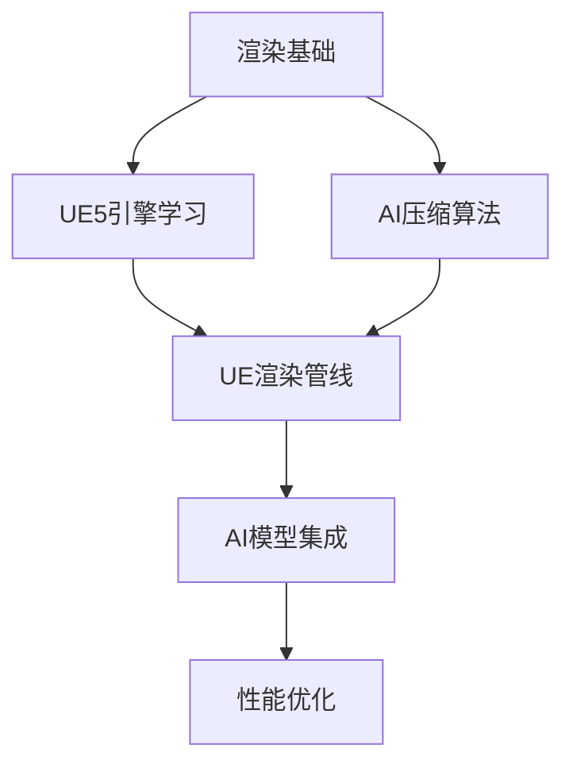

根据你提供的比赛介绍，这是一个结合 **AI渲染技术** 与 **游戏光照压缩** 的高阶赛题，主要涉及以下几个技术方向和学习内容：

---

## 🧠 一、核心知识领域

### 1. **全局光照（Global Illumination, GI）**
- 是什么：模拟光线在场景中多次反射的渲染技术
- 学习资料：
  - 《Real-Time Rendering》第四版 - 全局光照章节
  - 论文：《A Survey on Real-Time Global Illumination》
  - Unity/UE4官方文档中的GI介绍

### 2. **光照贴图（Lightmap）压缩技术**
- 传统方法：BC压缩、ASTC、PVRTC等
- AI方法：神经网络压缩（如Autoencoder、GAN-based压缩）
- 学习资料：
  - 论文：《Neural Light Field Compression》
  - NVIDIA的NGP（Neural Graphics Primitives）相关论文

### 3. **AI渲染管线（AI Rendering Pipeline）**
- 将AI模型集成到实时渲染流程中
- 需要了解：
  - UE渲染管线架构（Deferred/Forward Rendering）
  - 自定义Shader和Compute Shader
  - AI模型在渲染中的调用方式（ONNX Runtime、TensorRT等）

---

## 📚 二、具体学习内容

### 必须掌握的技术栈：
| 领域 | 具体内容 | 推荐学习资源 |
|------|----------|--------------|
| 游戏引擎 | **Unreal Engine 5**（不是Unity） | UE5官方文档、渲染管线教程 |
| AI压缩 | 自编码器、变分自编码器(VAE)、GAN | PyTorch/TensorFlow教程 |
| 渲染基础 | 着色器编程、光照模型 | 《Unity Shader入门精要》也可参考 |
| 工具链 | ONNX、TensorRT部署 | 官方文档+开源项目实践 |

---

## 🛠️ 三、针对赛题的专项学习

### 赛题1：光照贴图压缩
- 重点研究：**神经压缩 + 轻量化网络设计**
- 推荐论文：
  - 《Compressing Lightfield Proxies by Learning a Deep Network for Each View》
  - 《NeRF: Representing Scenes as Neural Radiance Fields for View Synthesis》

### 赛题2：AI渲染管线开发  
- 重点研究：**UE5渲染插件开发 + AI模型集成**
- 学习路径：
  1. UE5渲染管线基础
  2. UE插件开发（Render Graph系统）
  3. 在UE中集成ONNX Runtime
  4. 性能优化（GPU Profiling）

---

## 🎯 四、学习建议

1. **先确定技术栈**：这个比赛明显偏向**UE引擎**，不是Unity
2. **从基础开始**：先掌握传统光照贴图技术，再研究AI压缩
3. **重视实践**：下载UE5源码，编译并运行参考渲染管线
4. **团队分工**：建议分为“AI算法”和“引擎集成”两个方向

---

## 📖 五、推荐学习路线

如果你需要，我可以为你提供每个环节的详细学习资料和入门项目。你现在处于哪个学习阶段？这样我可以给出更有针对性的建议。