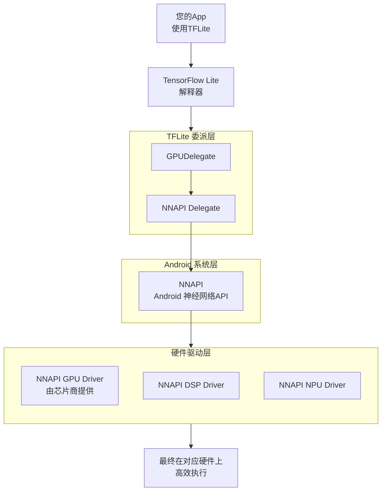

好的，这是一个关于 **GPUDelegate / NNAPI** 的详细解释。

简单来说，它们是两个在移动设备上用于**加速人工智能（AI）模型运行**的技术，但它们属于不同的层级，经常协同工作。

我们可以用一个比喻来理解：

*   **NNAPI（Android神经网络API）** 就像是手机的 **“AI指令总指挥官”**。它定义了一套标准的指令集，但自己不具体执行。
*   **GPUDelegate（GPU代理）** 就像是 **“显卡部队的指挥官”**。它专门负责调动GPU（显卡）来执行计算任务。

现在我们来详细看一下每一个。

---

### 1. NNAPI（Android Neural Networks API）

**NNAPI** 是 Google 在 Android 8.1（API level 27）中引入的一个系统级API。

*   **目标**：为机器学习库（如 TensorFlow Lite）提供一个基础层，利用移动设备上的各种硬件（如 GPU、DSP、NPU）来加速模型运算，而无需应用开发者直接与复杂的硬件驱动打交道。
*   **工作原理**：
    1.  应用（通过 TensorFlow Lite 等框架）将计算任务和模型提交给 NNAPI。
    2.  NNAPI 驱动程序会分析任务，并根据当前设备的可用硬件（称为“驱动程序”）来决定将计算任务分配给谁。
    3.  它可以自动在 CPU、GPU、DSP 或专用的 NPU 之间进行调度，选择最优的硬件来执行，或者将任务拆分到不同硬件上并行执行。
*   **优点**：
    *   **硬件无关性**：开发者只需使用一套API，就能利用设备上所有可用的加速硬件。
    *   **性能优化**：由芯片制造商（如高通、联发科）为其硬件提供优化的 NNAPI 驱动程序，从而获得最佳性能。
    *   **能效更高**：将繁重的计算从 CPU 卸载到更高效的 GPU 或 NPU 上，可以节省电量。

---

### 2. GPUDelegate（GPU 代理）

**GPUDelegate** 是 **TensorFlow Lite** 框架中的一个“代理”。

*   **目标**：专门利用移动设备的 **GPU** 来加速 TensorFlow Lite 模型的推理过程。
*   **工作原理**：
    1.  它是一个 TensorFlow Lite 的“插件”。
    2.  当你在 TensorFlow Lite 解释器中启用 GPUDelegate 后，解释器会将模型中适合在 GPU 上运行的操作（如卷积、矩阵乘法等）委托给它。
    3.  GPUDelegate 将这些操作转换为 GPU 能够理解的着色器程序，并在 GPU 上高效执行。
    4.  不适合在 GPU 上运行的操作（或者 GPUDelegate 不支持的操作）则会回退到 CPU 上执行。
*   **优点**：
    *   **高性能**：对于并行计算密集型的神经网络操作，GPU 通常比 CPU 快得多。
    *   **高能效**：GPU 为图形和并行计算而设计，执行 AI 任务时能效比通常优于 CPU。
    *   **易于使用**：开发者只需在 TensorFlow Lite 代码中添加几行，即可启用 GPU 加速。

---

### 它们之间的关系与协同工作

现在，关键点来了：**GPUDelegate 可以是 NNAPI 的一个具体实现者**。

当你使用 `GPUDelegate` 时，它的底层实现有两种可能：

1.  **直接使用 OpenCL / OpenGL ES**：在较早的版本或某些特定情况下，GPUDelegate 会直接通过图形 API（如 OpenCL 或 OpenGL ES 的计算着色器）来与 GPU 通信。
2.  **作为 NNAPI 的一个客户端**：在更现代和推荐的用法中，**GPUDelegate 实际上是通过调用 NNAPI 来实现的**。具体流程是：
    *   你的 App 使用 TensorFlow Lite。
    *   TensorFlow Lite 启用了 GPUDelegate。
    *   GPUDelegate 将任务请求发送给 Android 系统的 NNAPI。
    *   NNAPI 再调用由设备制造商提供的、针对该设备 GPU 高度优化的 **NNAPI GPU 驱动程序**。
    *   最终由这个底层的 GPU 驱动程序在 GPU 上执行计算。

这种关系可以用下图清晰地展示：

### 总结与对比

| 特性 | NNAPI | GPUDelegate |
| :--- | :--- | :--- |
| **层级** | **系统级API**（Android操作系统的一部分） | **框架级组件**（TensorFlow Lite 的一部分） |
| **范围** | **广泛**，可调度多种硬件（CPU/GPU/DSP/NPU） | **专注**，主要用于 GPU 加速 |
| **角色** | **“总指挥官”/“调度中心”** | **“专项部队指挥官”**（专攻GPU） |
| **使用方式** | 通常被上层的机器学习框架（如TFLite）调用，开发者一般不直接使用。 | 由开发者在TensorFlow Lite代码中显式启用。 |
| **关系** | 是更底层的标准和支持基础。 | 可以是基于NNAPI实现的一个具体应用。 |

**结论：**

对于在Android设备上使用 TensorFlow Lite 的开发者来说，**启用 `GPUDelegate` 是当前利用设备GPU加速模型推理的推荐和主流方式**。而在这个过程中，`GPUDelegate` 很可能通过 Android 系统的 `NNAPI` 来与设备GPU进行交互，从而获得稳定且经过硬件厂商优化的性能提升。