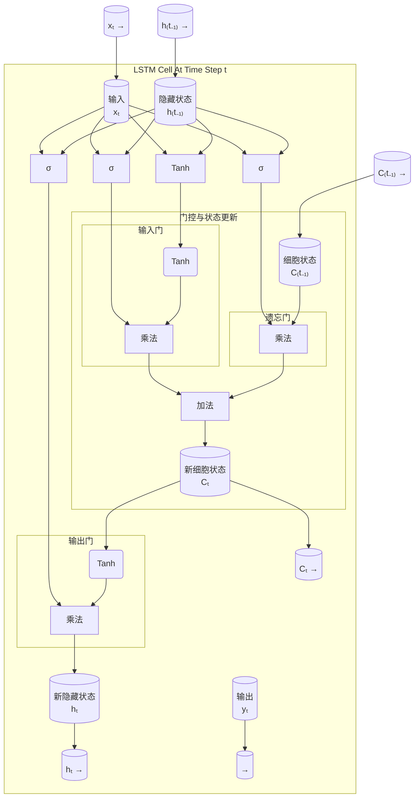
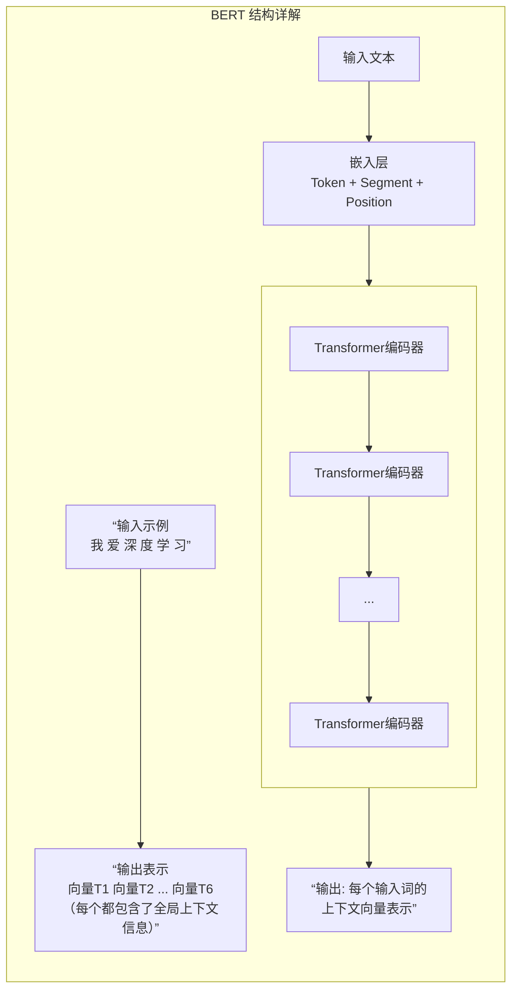
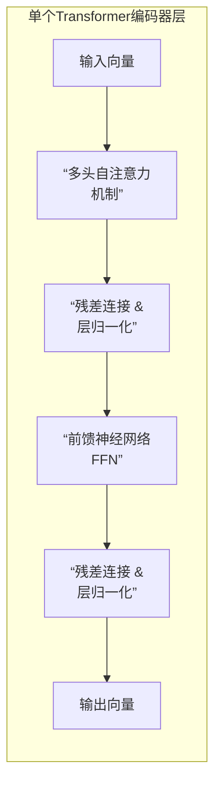

太好了！这些问题直抵现代深度学习的核心。LSTM和BERT都是处理序列数据的革命性模型，但它们的结构、目标和应用场景截然不同。

我会用一个比喻先帮你建立直觉，然后再深入结构。

### 一个简单的比喻：理解与写作

*   **LSTM**：像一个**非常专注的读者**。他读一句话时，会边读边记笔记，记住重要的上下文（比如主语是谁），并会主动忘记不重要的信息。他擅长**理解连续的、有逻辑顺序**的内容，比如预测下一个词或翻译句子。
*   **BERT**：像一个**参加了“完形填空”海量训练的语言学博士**。他拿到一篇文章，不是从头读到尾，而是可以**同时看到所有的词**。他通过疯狂做“完形填空”练习，深刻理解了每个词在不同上下文中的含义。他擅长为句子或词生成**深度的、上下文相关的表示**。

---

### 1. LSTM - 长短期记忆网络

LSTM是一种特殊的**循环神经网络**，专门设计来解决传统RNN的“长程依赖”问题——即模型难以记住很久以前的信息。

#### **LSTM的核心思想：“门控”记忆**

LSTM的关键在于它有一个**细胞状态**，可以看作是模型的“记忆传送带”。信息在这个传送带上流动，并通过三个精妙的“门”来控制信息的去留：

1.  **遗忘门**：决定从细胞状态中**丢弃哪些信息**。（“哪些旧信息不再相关了？”）
2.  **输入门**：决定将**哪些新信息存入**细胞状态。（“新的输入中哪些是值得记住的？”）
3.  **输出门**：决定基于当前的细胞状态**输出什么**。（“根据当前记忆和输入，我应该输出什么？”）

#### **LSTM的网络结构**

下图清晰地展示了LSTM单元内部的数据流和三个门控机制：

每个时间步，LSTM单元接收：
*   当前输入 \( x_t \)
*   上一个隐藏状态 \( h_{t-1} \)（可以看作是上一时间步的“总结”）
*   上一个细胞状态 \( c_{t-1} \)（长期记忆）

经过三个门的调控后，输出：
*   新的隐藏状态 \( h_t \)
*   新的细胞状态 \( c_t \)

**主要应用**：机器翻译、文本生成、语音识别、时间序列预测。**特点：顺序处理，不可并行。**

---

### 2. BERT - 来自Transformer的双向编码器表示

BERT是建立在**Transformer模型**之上的，它的核心突破是**双向上下文理解**。

#### **BERT的核心思想：完形填空预训练**

传统模型（包括LSTM）是单向的（从左到右或从右到左）读文本。而BERT在预训练时，会随机遮盖句子中15%的词（即`[MASK]`令牌），然后训练模型**根据所有未被遮盖的词（左右上下文）来预测被盖住的词**。这就迫使模型深刻理解每个词与句子中所有其他词的关系。

#### **BERT的网络结构**

BERT本质上是一个由多个**Transformer编码器**堆叠而成的网络。

**深入看一个Transformer编码器的结构：**

**关键组件解释：**

1.  **输入嵌入**：将每个词转换为一个向量。同时加上：
    *   **位置编码**：告诉模型每个词的位置信息（因为Transformer本身没有顺序概念）。
    *   **段落编码**：用于区分两个句子。
2.  **多头自注意力机制**：这是BERT实现“双向理解”的魔法所在。
    *   **自**：模型会查看输入序列中的**所有词**。
    *   **注意力**：对于序列中的每一个词，模型都会计算它与序列中**所有其他词**（包括它自己）的关联度（注意力分数）。
    *   **多头**：模型并行地进行多次注意力计算，每次关注不同方面的上下文信息（比如语法、语义等）。
3.  **前馈神经网络**：对自注意力的输出进行进一步的非线性变换。

**主要应用**：
*   **文本分类**（如情感分析）
*   **问答系统**（如SQuAD）
*   **语义相似度**计算
*   **命名实体识别**
*   **作为特征提取器**，为其他任务提供强大的词/句向量。

**特点：可以并行计算，训练效率高；预训练+微调的范式，通用性极强。**

---

### LSTM vs. BERT 对比总结表

| 特性 | LSTM | BERT |
| :--- | :--- | :--- |
| **核心机制** | 门控循环单元，顺序处理 | 自注意力机制，并行处理 |
| **上下文理解** | 单向或浅层双向，受限于序列长度 | **深度双向**，同时看到整个句子 |
| **训练范式** | 通常从零开始训练特定任务 | **预训练 + 微调**，在大规模语料上先学习语言本身 |
| **计算效率** | 顺序依赖，难以并行，训练慢 | 可并行计算，训练快（但模型大，推理耗资源） |
| **主要优势** | 适合流式数据、序列生成任务 | 对上下文理解更深，在下游任务上表现SOTA |
| **结构形象** | 一条有记忆的“传送带” | 一个堆叠的“全连接注意力网络” |

**简单总结：**

*   **LSTM** 是处理**序列**问题的强大工具，像一个有经验的读者，按顺序理解和生成。
*   **BERT** 是理解**语言本身**的里程碑，它通过“完形填空”学会了语言的深层规律，能为任何词和句子生成包含全局信息的“身份证”，从而在各种自然语言处理任务中表现出色。