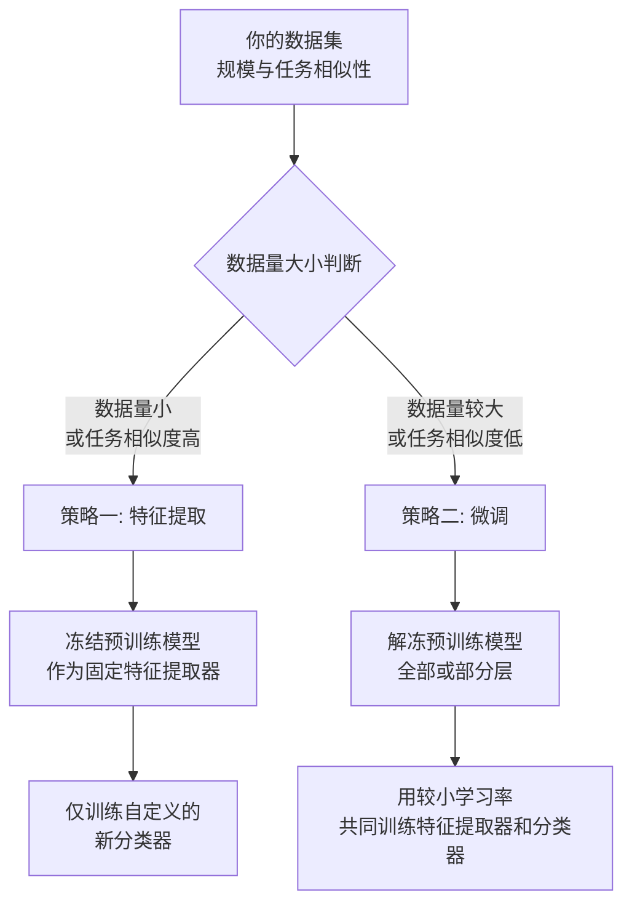

好的，迁移学习是一个非常强大且流行的技术，尤其在深度学习领域。我会用类比和直观的方式解释清楚。

### 一、核心思想：用一个绝妙的比喻

想象一位已经学习了多年、知识渊博的**医学专家**。

- 现在，有一个新的任务：成为一名**顶级的皮肤病专家**。
- **传统方法（从零学习）**：让他忘掉所有医学知识，像小学生一样从头开始学习人体结构、生物学、化学等所有基础知识，然后再学皮肤病。这显然非常低效且耗时。
- **迁移学习方法**：直接基于他已有的、深厚的**医学知识**（例如解剖学、药理学），让他**专注于学习皮肤病领域的特定知识和最新研究**。

在这个比喻中：
- **医学专家** = 一个在大型通用数据集（如ImageNet）上预训练好的模型。
- **医学知识** = 模型学到的通用特征（如识别边缘、纹理、形状、物体部件）。
- **皮肤病专家** = 你想要为你的特定任务（如皮肤癌分类）打造的模型。
- **学习皮肤病知识** = 用你的特定数据集（皮肤图像）对预训练模型进行微调。

---

### 二、迁移学习的正式定义

**迁移学习**是指将一个在**源任务**上学习到的知识和模型，通过调整，应用到另一个相关的**目标任务**上的过程。

其核心动机是：
1.  **避免重复造轮子**：利用已有的、花费了巨大算力和数据训练出的模型。
2.  **解决数据匮乏**：当你的目标任务数据很少时，迁移学习特别有效。
3.  **加快训练速度，提升模型性能**：模型已经具备了良好的特征提取能力，不需要从随机状态开始学习。

---

### 三、为什么要用迁移学习？（好处）

1.  **高性能的捷径**：你可以在几分钟或几小时内，用很少的数据就训练出一个表现优异的模型。而从零开始训练一个同样水平的模型可能需要数周和巨大的计算资源。
2.  **数据需求量小**：对于你的特定任务，可能只需要几百张甚至几十张图片，就能取得很好的效果。因为模型已经知道“如何看图片”。
3.  **入门门槛低**：你不需要从零开始设计复杂的网络结构，可以直接使用经过千锤百炼的成熟架构（如ResNet, VGG, BERT）。

---

### 四、如何进行操作？—— 实践指南

以下是进行迁移学习的典型步骤，其核心流程是根据你的数据量和新旧任务之间的相似性来选择策略，如下图所示：



下面我们对这两种策略进行详细说明：

#### 准备工作：
- **选择一个预训练模型**：从PyTorch Hub、TensorFlow Hub、Hugging Face等平台获取一个在大型数据集（如图像领域的ImageNet， NLP领域的Wikipedia+BookCorpus）上预训练好的模型。

#### 策略一：特征提取

- **做法**：
    1.  **冻结**预训练模型的所有层（即设置它们的参数不可训练，不更新梯度）。
    2.  移除预训练模型原来的顶层（分类器），**替换成一个新的、随机初始化的、符合你任务类别数量的分类器**。
    3.  在训练时，**只训练你新添加的顶层**。

- **何时使用**：
    - 你的**数据集很小**，且与预训练模型使用的数据集**非常相似**。
    - **训练速度极快**，因为大部分参数都不更新。

#### 策略二：微调

- **做法**：
    1.  同样，**替换掉预训练模型的顶层**。
    2.  **解冻**预训练模型的一部分或全部层，使其参数可以更新。
    3.  用**相对较小的学习率**（通常比训练新分类器的学习率小10倍）在你的数据集上**重新训练整个网络**。

- **何时使用**：
    - 你的**数据集比较大**（例如几千上万张图片）。
    - 你的任务和预训练模型的原始任务**差异较大**（例如，用ImageNet训练的模型去处理医学影像）。这时模型需要调整其底层的通用特征来适应新领域。

**微调时的一个常见技巧：渐进式解冻**
- 先只微调最后几层，然后逐步解冻更深的层。因为浅层学习的是通用特征（边缘、颜色），深层学习的是特定特征（猫脸、车轮）。对于差异大的任务，需要调整更多层。

---

### 五、一个简单的代码示例（PyTorch思想）

以下是在PyTorch中实现**微调**的典型代码框架：

```python
import torch
import torchvision.models as models
import torch.nn as nn

# 1. 加载预训练模型（例如ResNet18）
model = models.resnet18(pretrained=True)

# 2. 替换最后的全连接层（分类器）
# ResNet18原始的最后一层是1000个输出（对应ImageNet的1000类），我们改为10类
num_ftrs = model.fc.in_features  # 获取原始全连接层的输入特征数
model.fc = nn.Linear(num_ftrs, 10)  # 用新的全连接层替换，10是目标类别数

# 3. 定义损失函数和优化器
criterion = nn.CrossEntropyLoss()

# 优化器：只训练我们新添加的顶层，可以设置其他层的学习率为0或很小
# 方法A：只训练最后一层
# optimizer = torch.optim.SGD(model.fc.parameters(), lr=0.001, momentum=0.9)

# 方法B：微调所有层，但用不同的学习率（通常最后一层的学习率更大）
optimizer = torch.optim.SGD([
    {'params': model.layer4.parameters(), 'lr': 0.001},    # 最后一层组，较高学习率
    {'params': model.layer3.parameters(), 'lr': 0.0001},   # 中间层，较低学习率
    # ... 可以继续为更浅的层设置更小的学习率
    {'params': model.fc.parameters(), 'lr': 0.01}          # 新分类器，最高学习率
], momentum=0.9)

# 4. 训练循环（这里简化表示）
model.train()
for inputs, labels in your_dataloader:
    optimizer.zero_grad()
    outputs = model(inputs)
    loss = criterion(outputs, labels)
    loss.backward()
    optimizer.step()
```

### 总结

**迁移学习是什么？**
- **思想**：站在巨人的肩膀上，利用已有的知识解决新问题。
- **做法**：取一个预训练模型，根据你的数据量和任务差异，选择是**将其作为固定的特征提取器**，还是**对其进行微调**。

这是一种极其高效且实用的技术，是当今AI工程师和应用研究人员的必备技能。