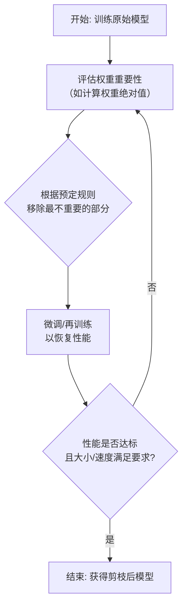

好的，模型剪枝是一个非常有趣且重要的模型优化技术。我会用一种由浅入深的方式，结合生动的比喻来解释它是如何实现的。

### 一、核心思想：用一个比喻来理解

想象一棵茂盛的盆栽（你的原始模型）。它虽然枝叶繁茂，但有些枝条和叶子是**冗余的**，剪掉它们不仅不会影响盆栽的整体形状和健康，反而会让它更美观、更集中养分给主要的枝条。

**模型剪枝就是同样的道理：**
- **目标**：识别并移除模型中的冗余部分（权重、神经元等），得到一个更小、更快、更高效的模型。
- **关键**：确保在移除这些部分后，模型的性能（准确率）不会显著下降。

---

### 二、剪枝的详细步骤

剪枝通常是一个迭代的过程，而不是一步到位。其核心工作流如下图所示：



下面我们来详细讲解图中的每一个步骤：

#### 第1步：训练一个基准模型
- 首先，你需要一个**已经训练好**的、性能良好的原始模型（“茂盛的盆栽”）。你不能对一个没训练好的模型进行剪枝，因为你无法判断哪些部分是真正重要的。

#### 第2步：评估重要性
- 这是剪枝的**核心决策环节**。我们需要一个**度量标准**来判断模型中哪些参数（权重）是“不重要”的。
- **最常用、最简单的标准是：权重的绝对值（Magnitude）。**
    - **思想**：一个权重的绝对值越小，说明它对最终输出的贡献也越小，激活得也越不频繁。因此，将它移除（设为0）对网络的影响也最小。
    - 例如，一个权重是 0.001，另一个是 1.5。显然，将 0.001 这个权重剪掉，对网络的影响微乎其微。

#### 第3步：执行剪枝
- 根据选择的重要性标准，我们按照预定的**剪枝比例**（例如，“移除全部权重中最小的20%”）来移除这些不重要的权重。
- **如何“移除”？**
    - 在代码实现上，我们并不是真的从矩阵中删除这个元素（那样会破坏数据结构），而是**将其设置为0**。
    - 这会产生一个**稀疏的**权重矩阵（矩阵中大部分元素是0）。稀疏矩阵非常有利于压缩和加速。

#### 第4步：微调与再训练
- **这是至关重要的一步！** 剪枝后的模型性能肯定会有所下降，就像刚理完发需要适应一下。
- 我们使用原来的训练数据，对**剪枝后的模型**进行**少量几个epoch的再训练**。
- 这个过程会让模型**自适应新的、更精简的结构**，调整剩余的权重来弥补剪枝带来的性能损失，从而最大限度地恢复准确率。

#### 第5步：迭代（可选但常用）
- 对于要求较高的场景，通常会重复步骤2-4。
- 例如：先剪20% -> 微调 -> 再剪10% -> 再微调 -> ... 直到模型大小或速度达到目标，或者准确率下降到可接受的阈值为止。这种“渐进式剪枝”通常比一次性剪掉大量权重效果更好。

---

### 三、剪枝的不同粒度

剪枝可以发生在不同的层次上，粒度越粗，获得的加速比通常越高。

| 粒度水平 | 操作对象 | 比喻 | 优点 | 缺点 |
| :--- | :--- | :--- | :--- | :--- |
| **权重剪枝** | 单个权重 | 剪掉一片片**叶子** | 粒度细，灵活度高，稀疏性好 | 不规则，难以在实际硬件上加速 |
| **通道剪枝** | 整个特征通道 | 剪掉一整根**枝条** | **规则剪枝**，易于加速，压缩率高 | 粒度粗，可能对精度影响较大 |
| **层剪枝** | 整个网络层 | 砍掉一整根**大树枝** | 极大减小模型尺寸和计算量 | 风险高，可能严重破坏模型能力 |

---

### 四、一个简单的代码示例（思想）

以权重剪枝为例，其核心逻辑可以用以下伪代码表示：

```python
import torch

# 假设 model 是一个已经训练好的PyTorch模型
pruning_rate = 0.2  # 剪枝率：20%

all_weights = []
for param in model.parameters():
    if len(param.shape) == 4:  # 只考虑卷积层的权重
        all_weights.append(param.data.abs().view(-1)) # 取绝对值并展平

# 将所有卷积权重拼接成一个大的向量
all_weights = torch.cat(all_weights)
# 计算阈值：找出排名在20%位置的权重值
threshold = torch.quantile(all_weights, pruning_rate)

# 执行剪枝：将小于阈值的权重置为0
for param in model.parameters():
    if len(param.shape) == 4:
        mask = param.data.abs() > threshold  # 创建一个布尔掩码，重要权重为True
        param.data.mul_(mask)                # 将不重要的权重(False处)乘以0，从而置零

# 接下来进行微调...
# optimizer = ...
# ... 进行几个epoch的训练 ...
```

### 总结

**模型剪枝是如何实现的？**

1.  **训练一个原始模型**。
2.  **定义一个重要性标准**（如权重绝对值）。
3.  **根据标准移除最不重要的部分**（将其权重设为0）。
4.  **对剪枝后的模型进行微调**，以恢复性能。
5.  **迭代进行**直至满足要求。

最终，你得到了一个**更小、更快、但性能几乎无损的模型**，它非常适合部署在计算资源有限的边缘设备（如手机、嵌入式设备）上。它与**量化**（降低权重数值精度）一起，构成了模型压缩和加速的两大核心技术。