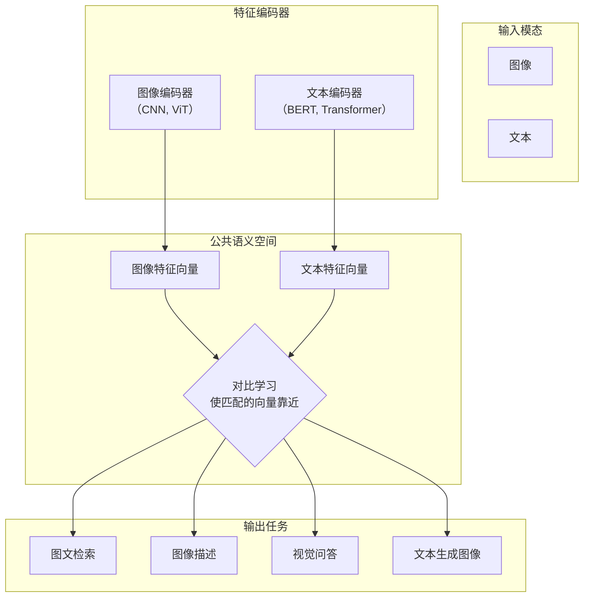

好的，这是一个非常核心的话题。文本图像多模态的本质是**让机器能够理解和建立视觉信息（图像）和语言信息（文本）之间的关联**。

这个过程可以类比为教一个孩子看图说话和听描述画画。它主要分为以下几个关键步骤和核心技术：

### 一、核心思想：寻找一个“公共语义空间”

多模态模型的核心目标是，将来自不同模态（如图像和文本）的数据，映射到同一个高维的语义空间里。在这个空间里：

*   “一只猫的图片” 和 “一只猫的描述” 的向量表示会非常接近。
*   “一只狗的图片” 和 “一只猫的描述” 的向量表示会相距甚远。

一旦找到了这个公共空间，我们就可以实现跨模态的检索、生成和问答。

### 二、技术流程详解

#### 1. 特征提取

*   **图像侧**：
    *   使用 **CNN（如 ResNet）** 或 **Vision Transformer（ViT）** 作为编码器。
    *   模型将一张图片分割成多个小块（Patch），提取出高级的、抽象的特征，最终输出一个或多个特征向量。这个向量包含了图片的视觉信息。

*   **文本侧**：
    *   使用 **Transformer 模型（如 BERT, RoBERTa, GPT）** 作为编码器。
    *   模型将输入文本（例如“一只坐在草地上的猫”）进行分词（Tokenization），然后生成一个能够捕捉语义信息的特征向量。

#### 2. 模态对齐

这是最关键的一步，即如何让上述两个特征向量在“公共语义空间”内对齐。主流方法有：

*   **对比学习（Contrastive Learning）**：
    *   **核心思想**：**拉近匹配的（正样本），推开不匹配的（负样本）**。
    *   **训练过程**：模型会看到很多（图像，文本）对。对于一张猫的图片，其正确的描述“一只猫”是正样本，而“一辆汽车”或其他图片的描述就是负样本。
    *   **代表模型**：**CLIP**。CLIP 通过在海量的（图像，文本）对上进行对比学习，学会了将任意图片和其描述关联起来。这正是图文检索和零样本分类的基础。

*   **融合编码器（Fusion Encoder）**：
    *   **核心思想**：不仅仅是对齐，而是让两种特征进行深度交互和融合，以完成更复杂的任务。
    *   **训练过程**：将图像特征和文本特征拼接在一起，或者通过交叉注意力机制，让文本Token去关注图像中相关的区域，反之亦然。
    *   **代表模型**：
        *   **VisualBERT, VL-BERT**：用于视觉问答、图像描述生成等。
        *   **BLIP 系列**：特别擅长理解和生成任务。

### 三、具体任务如何实现？

基于上述技术，我们可以完成多种多样的任务：

1.  **图文检索**：
    *   **图搜文**：输入一张图片，在公共空间计算它与所有文本特征的相似度，返回最相似的文本。
    *   **文搜图**：输入一段文本，返回最相似的图片。
    *   **代表模型**：**CLIP**。

2.  **图像描述**：
    *   输入一张图片，先用图像编码器提取特征。
    *   然后将这个特征作为一个“提示”或“前缀”，输入到一个语言模型（如 GPT）中，由语言模型生成一句描述性文字。
    *   **代表模型**：**BLIP-2**，它使用一个叫做 Q-Former 的模块高效地连接了图像编码器和语言模型。

3.  **视觉问答**：
    *   输入一张图片和一个关于图片的问题（例如：“图片中的猫是什么颜色的？”）。
    *   模型需要同时理解图片内容（找到猫）和文本问题（理解“颜色”这个概念），然后融合这两种信息，最终从词汇表中生成或选择答案（如“白色”）。
    *   **代表模型**：**BLIP-2**, **Flamingo**。

4.  **文本生成图像**：
    *   这个过程可以看作是“图像描述”的逆过程。
    *   输入一段文本描述，通过一个**扩散模型** 或 **自回归生成模型**，从随机噪声开始，一步步地“画”出符合文本描述的图像。
    *   文本特征通过交叉注意力机制指导图像的生成过程。
    *   **代表模型**：**DALL-E 3**, **Stable Diffusion**, **Midjourney**。

### 总结

文本图像多模态的实现，可以概括为：

*   **编码**：使用强大的编码器（ViT, Transformer）分别提取图像和文本的特征。
*   **对齐/融合**：通过对比学习或交叉注意力机制，在公共语义空间中建立两种模态的深刻联系。
*   **任务执行**：利用对齐或融合后的特征，完成下游任务（检索、生成、问答等）。

近年来，尤其是 **CLIP** 和 **扩散模型** 的出现，极大地推动了多模态领域的发展，使得我们现在能够体验到如此强大和易用的AI应用。

