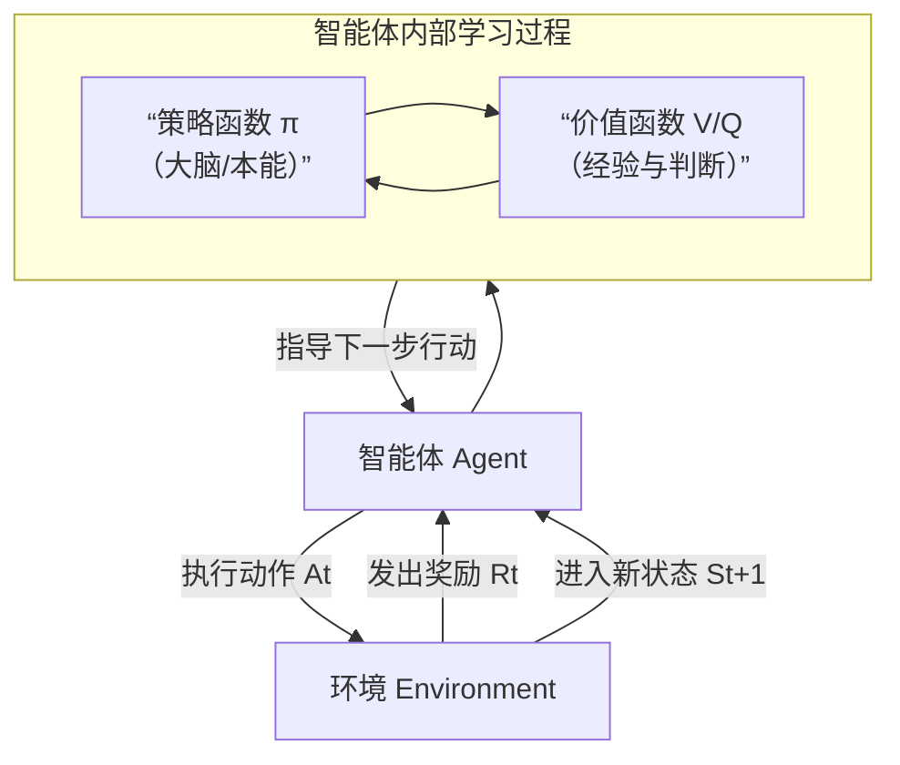

好的，我们用一种清晰、结构化的方式来解释强化学习的核心机制，重点说明**智能体（Agent）**、**环境（Environment）** 以及两个核心函数：**策略函数**和**价值函数**。

你可以把整个过程想象成**训练一只狗**：
*   **智能体** = 狗
*   **环境** = 你和房间
*   **动作** = 坐下、趴下、打滚
*   **奖励** = 零食（正向）或呵斥（负向）
*   **目标** = 学会一套能获得最多零食的动作序列。

---

### 核心机制：试错学习循环

强化学习的运行基于一个**智能体与环境持续交互的闭环**。这个循环包含五个关键元素，如下图所示，清晰地展示了智能体如何感知环境、采取行动、获得反馈并更新知识，从而逐步学习最优行为策略：

这个循环的每一步可以拆解为：
1.  **感知状态**：在时间步 `t`，智能体观察到环境的当前状态 `S_t`。
2.  **决策**：智能体根据其内部的**策略函数**，决定要执行的动作 `A_t`。
3.  **执行与反馈**：智能体执行动作 `A_t`。环境随之发生变化，并给予智能体一个**即时奖励（Reward）** `R_{t+1}`，同时转移到**新的状态** `S_{t+1}`。
4.  **学习与更新**：智能体将这次交互的经验 `(S_t, A_t, R_{t+1}, S_{t+1})` 存储起来，并用来更新其内部的**策略函数**和**价值函数**，以期在未来获得更多的累积奖励。
5.  **循环**：新的状态 `S_{t+1}` 成为下一轮交互的起点，循环继续。

**最终目标**：不是最大化单次即时奖励，而是最大化从当前开始未来的**累积奖励（称为回报，Return）**。

为了实现这个目标，智能体需要依赖两个核心的“大脑”组件：**策略函数**和**价值函数**。它们的关系在上图中已体现：策略函数是决策的直接依据，而价值函数为策略的评估和优化提供判断标准，两者在训练过程中协同进化。

---

### 两大核心函数：策略与价值

#### 1. 策略函数 - “做什么？”
策略是智能体的**行为指南**，它直接定义了在给定状态下应该采取什么动作。
*   **定义**：从**状态（S）** 到**动作（A）** 的映射。可以看作是智能体的“本能”或“战术手册”。
*   **表示**：
    *   **确定性策略**：`a = π(s)`。看到状态 `s`，明确执行动作 `a`。
    *   **随机性策略**：`π(a|s) = P(A=a | S=s)`。看到状态 `s`，以一定概率分布选择不同的动作（例如，70%向左，30%向右）。这在需要探索时非常重要。
*   **作用**：它是智能体**直接控制和优化**的对象。强化学习的终极目标就是找到一个**最优策略 π***，使得遵循它能够获得最大的累积奖励。

#### 2. 价值函数 - “多好？”
价值函数是智能体的**评价体系**，它评估从某个状态（或在某个状态下采取某个动作）出发，未来能获得多少**累积奖励的期望值**。它回答的是“这个局面有多好？”或“在这个局面下走那一步有多好？”。

**a) 状态价值函数 `V(s)`**
*   **定义**：在状态 `s` 下，**遵循当前策略 π** 所能获得的未来累积奖励的期望值。
*   **公式（简化）**：`Vπ(s) = E[ R_{t+1} + γR_{t+2} + γ²R_{t+3} + ... | S_t = s, π ]`
*   **解读**：`γ` 是**折扣因子**（0 ≤ γ ≤ 1），给未来的奖励打个折扣，更重视近期奖励。`V(s)` 高，说明状态 `s` 是个“好局面”。

**b) 动作价值函数 `Q(s, a)`**
*   **定义**：在状态 `s` 下，**执行特定动作 a**，然后从此之后**遵循当前策略 π** 所能获得的未来累积奖励的期望值。
*   **公式（简化）**：`Qπ(s, a) = E[ ... | S_t = s, A_t = a, π ]`
*   **解读**：它比 `V(s)` 更精细，评价的是“在某个状态下，做某个具体动作”的长期价值。

**两者关系**：`Vπ(s)` 是 `Qπ(s, a)` 在策略 π 下的“平均值”（按动作概率加权平均）。即：`Vπ(s) = Σ π(a|s) * Qπ(s, a)`。

---

### 二者如何协同工作？

策略函数和价值函数共同构成了智能体的认知系统，它们协同工作的方式主要有两种经典模式：

1.  **基于价值的（Value-Based）方法（如Q-Learning，DQN）**：
    *   **核心**：先通过大量经验学习一个非常精准的 **`Q(s,a)` 函数**（称为Q表或Q网络）。
    *   **策略是隐式的**：策略直接由价值函数推导出来。一旦学到了最优的 `Q*(s,a)`，最优策略就是**在每个状态 `s` 选择 `Q` 值最大的动作 `a`**。即：`π*(s) = argmax_a Q*(s, a)`。
    *   **比喻**：你心里有一张详细的“美食地图”（Q函数），记录了每家餐厅每道菜的综合评分。你的策略就是：走到哪里，都点当前餐厅评分最高的那道菜。

2.  **基于策略的（Policy-Based）方法（如策略梯度）**：
    *   **核心**：**直接学习并优化策略函数 `π(a|s)`** 的参数。价值函数可能作为辅助（如计算梯度方向），也可能完全不使用。
    *   **比喻**：你通过反复练习，直接形成了一套条件反射（策略）。看到一个姿势（状态），手（动作）就自动摆出对应的格挡。你可能说不出（不显式计算）这个姿势“好”在哪里（价值函数），但你知道这么做有效。

3.  **演员-评论家（Actor-Critic）方法（两者结合，主流方法）**：
    *   **核心**：这是目前最强大、最主流的框架。它同时学习**两个部分**：
        *   **演员（Actor）**：即**策略函数**，负责根据状态选择动作。
        *   **评论家（Critic）**：即**价值函数**（通常是 `V(s)`），负责评价演员在当前状态下的表现好坏，并给出“分数”。
    *   **工作流程（对应核心循环图）**：演员（策略）做出动作 -> 环境反馈奖励和新状态 -> 评论家（价值函数）根据奖励评估这个动作，并“告诉”演员：“这个动作在刚才的状态下是加分还是减分？” -> 演员根据评论家的“建议”更新自己的策略，下次在类似状态下更倾向于做出被表扬的动作。
    *   **比喻**：演员在台上演戏，评论家在台下看。演员每做一个动作（策略），评论家就根据观众（环境）的反应（奖励）给出专业点评（价值梯度）。演员根据点评不断调整自己的演技。

### 总结

| 组件 | 角色 | 回答的问题 | 类比 |
| :--- | :--- | :--- | :--- |
| **策略函数 `π`** | **决策者** | “我现在应该怎么做？” | 驾驶员（决定方向盘怎么打） |
| **价值函数 `V/Q`** | **评估者** | “这个局面/选择长期来看有多好？” | 导航评分系统（评估每条路的通畅程度和预计用时） |
| **强化学习机制** | **学习循环** | “如何通过试错找到最佳驾驶方式？” | 驾驶员（策略）根据导航评分（价值）和实际路况（奖励），不断调整自己的驾驶习惯，最终找到最优路线。 |

简单来说，强化学习的机制就是智能体通过**策略函数**与环境互动，利用**价值函数**评估和引导策略的更新，在“探索-利用”的平衡中，不断试错、学习，最终找到能最大化长期收益的最优行为策略。**演员-评论家**框架完美体现了二者的协同，是现代强化学习算法的基石。