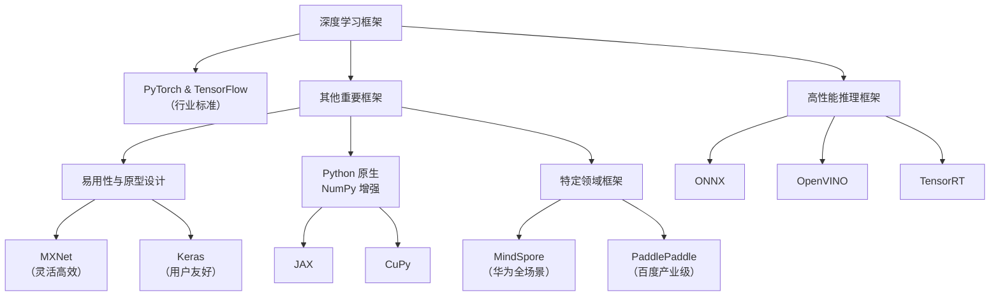

参考资料：
- https://pytorch-cn.com/tutorials/recipes/quantization.html
- https://pytorch.org/blog/introduction-to-quantization-on-pytorch/

## ExecuTorch 与 PyTorch Mobile

PyTorch Mobile 通过 TorchScript 将 PyTorch 模型部署到资源受限设备。相比之下，ExecuTorch 在二进制体积和动态内存使用上更小，因而在性能与便携性上具有优势。ExecuTorch 不依赖于 TorchScript，而是利用 PyTorch 2 的编译器与导出能力，在设备端直接执行模型。

## TensorFlow Lite 与 LiteRT

LiteRT（Lite Runtime）是 TensorFlow Lite (TFLite) 在运行时方向上的演进名称。尽管称呼有所变化，其在设备端提供的高性能推理能力依然可靠，并扩展为支持更多框架（如 PyTorch、JAX 与 Keras）编写的模型。

自 2017 年推出以来，TFLite 已广泛部署在数十亿设备中。LiteRT 的定位体现了更开放的多框架愿景：让开发者用任意流行框架训练模型，再在设备端以优秀性能运行。它是 Google AI Edge 工具链的一部分，可在 Android、iOS 与嵌入式设备上无缝部署模型，并配合模型转换与优化工具支持开源与自定义模型。

## 除了 TensorFlow 和 PyTorch 还有其他框架吗？

当然。深度学习生态远不止两大巨头，许多替代框架在设计理念、使用场景和生态上各有侧重。下图给出一个总体概览：

下面对各类框架做简要说明：

### 一、其他重要的通用框架

1. MXNet  
   - 特点：亚马逊主导，灵活且高效，支持多语言前端（Python、Scala、R 等）。Gluon 接口提供类似 Keras 的易用体验。  
   - 适用场景：分布式训练与生产部署。社区活跃度低于 PyTorch/TensorFlow。

2. JAX  
   - 特点：由 Google 开发，侧重可组合的函数变换，集成 Autograd 与 XLA。不是完整框架，但作为计算与变换基础非常强大。  
   - 适用场景：前沿科研、数学密集型算法开发。常见上层库：Flax、Haiku。

3. Keras  
   - 特点：高阶、用户友好，已整合为 TensorFlow 的官方高阶 API（tf.keras）。  
   - 适用场景：初学者与快速原型设计。

### 二、特定领域或公司主导的框架

1. MindSpore  
   - 背景：华为开发，强调端-边-云协同与软硬协同，针对昇腾芯片有优化。适用于华为生态与部分工业场景。

2. PaddlePaddle  
   - 背景：百度开发，包含完整工具链（模型开发、服务与部署）。在中文语料与产业级模型方面资源丰富，广泛用于中国工业界。

### 三、高性能推理与部署框架

1. ONNX  
   - 功能：开放神经网络交换格式，解决框架间互操作性问题，便于在多种推理引擎上运行模型。

2. TensorRT  
   - 背景：NVIDIA 平台的高性能推理 SDK，对模型做融合、定点量化与内核自动调优，适合在 NVIDIA GPU 上极致优化延迟与吞吐。

3. OpenVINO  
   - 背景：英特尔推出，针对英特尔硬件（CPU、集成 GPU、VPU）优化推理性能，尤其在计算机视觉任务上表现突出。

### 四、NumPy 风格的数组计算库

- CuPy：与 NumPy 高度兼容但运行于 NVIDIA GPU，适用于需要自定义算子或在研究中利用 GPU 加速的场景。

### 总结与选型建议

| 框架 | 主要特点 | 适用场景 |
| :--- | :--- | :--- |
| PyTorch | 动态图、Pythonic、易调试 | 学术研究与原型开发 |
| TensorFlow | 静/动态图支持、生产部署成熟 | 工业级生产、跨平台部署（含 TF Lite） |
| JAX | 函数式、可组合变换、性能优 | 前沿科研与数学密集型开发 |
| MXNet | 灵活高效、多语言支持 | 分布式训练与云服务 |
| Keras | 简单易用、API 清晰 | 初学者与快速原型 |
| MindSpore | 全场景、软硬协同 | 华为昇腾生态与相关场景 |
| PaddlePaddle | 产业级工具链、模型资源丰富 | 中国工业界与百度生态 |

如何选择：
- 初学者或想快速上手：Keras / PyTorch。  
- 学术研究或需要灵活自定义：PyTorch 或 JAX。  
- 工业级生产部署：TensorFlow 仍然成熟，PyTorch 结合 TorchScript/ONNX 也很常见；可根据目标硬件选择 TensorRT、OpenVINO 等加速方案。  
- 针对特定硬件：昇腾选 MindSpore，英特尔选 OpenVINO，NVIDIA 选 TensorRT。

希望这个梳理能帮助你更清晰地理解各类框架的定位与适用场景。
