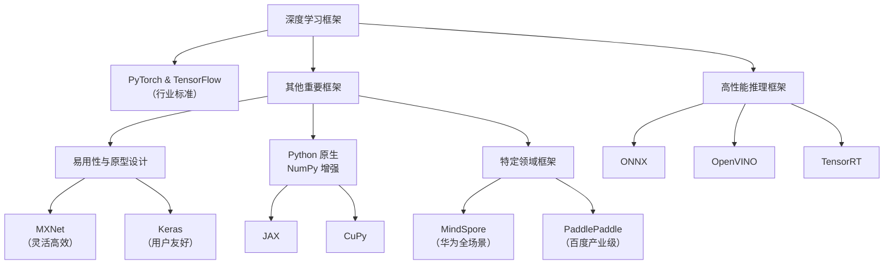

https://pytorch-cn.com/tutorials/recipes/quantization.html
https://pytorch.org/blog/introduction-to-quantization-on-pytorch/

## ExecuTorch 和 PyTorch Edge 

PyTorch Mobile 使用 TorchScript 允许 PyTorch 模型在资源有限的设备上运行。与 PyTorch Mobile 相比，ExecuTorch 具有明显更小的内存大小和动态内存占用，从而具有卓越的性能和便携性。此外，ExecuTorch 不依赖于 TorchScript，而是利用 PyTorch 2 编译器和导出功能在设备上执行 PyTorch 模型。

## TensorFlow Lite 和 LiteRT
LiteRT（Lite Runtime 的缩写）是 TensorFlow Lite (TFLite) 的新名称。虽然这个名字是新的，但它仍然是设备上人工智能的同样值得信赖的高性能运行时，现在具有扩展的视野。

自 2017 年推出以来，TFLite 已助力开发者在约 27 亿台设备上的超 10 万个应用中实现了 ML 驱动的体验。最近，TFLite 的发展已经超越了其最初的 TensorFlow 基础，开始支持用 PyTorch、JAX 和 Keras 编写的模型，并提供同样的领先性能。LiteRT 这个名称体现了面向未来的多框架愿景：使开发者能够以任何流行的框架开始构建，并在设备端以卓越的性能运行其模型。

LiteRT 是 Google AI Edge 工具套件的一部分，可让您在 Android、iOS 和嵌入式设备上无缝部署 ML 与 AI 模型的运行库。借助 AI Edge 强大的模型转换和优化工具，您可以为设备端开发同时准备好开源模型和自定义模型。

##  除了 TensorFlow 和 PyTorch还有别的框架吗

当然有！除了 TensorFlow 和 PyTorch 这两个巨头，深度学习领域还存在许多其他优秀且各有特色的框架。

这些框架可以根据其设计哲学、生态系统和最佳应用场景进行分类。下图为您呈现了一个清晰的框架生态概览：

下面我们来详细了解一下这些框架的特点：

### 一、 其他重要的通用框架

这些框架同样具备构建和训练复杂模型的能力。

1.  **MXNet**
    *   **特点**：由亚马逊AWS主导，以**高效**和**灵活**著称。支持多种编程语言前端（如Python、Scala、R等），特别适合**分布式训练**和**生产环境部署**。其Gluon接口提供了类似Keras的简易API。
    *   **优势**：内存优化好，跨平台部署能力强。
    *   **现状**：虽然非常优秀，但社区活跃度和受欢迎程度略逊于PyTorch和TensorFlow。

2.  **JAX**
    *   **特点**：由Google开发，不是一个端到端的深度学习框架，而是一个**可组合的函数变换库**。它集成了**Autograd**（自动微分）和 **XLA**（加速线性代数），是许多新兴库（如Flax、Haiku）的基础。
    *   **优势**：函数式编程范式，代码非常简洁和数学化。在**科研**领域，尤其是涉及自定义复杂计算和优化的场景中越来越受欢迎。
    *   **代表库**：**Flax**, **Haiku** (由DeepMind开发)，这些库在JAX之上提供了神经网络模块抽象。

3.  **Keras**
    *   **特点**：最初是一个独立的、**高层次的API**，以其**极简**和**用户友好**的设计哲学闻名。它能够以TensorFlow、Theano或CNTK作为后端运行。
    *   **现状**：现在已完全集成到TensorFlow中作为其官方高阶API (`tf.keras`)。对于初学者和小型项目来说，它仍然是快速上手的最佳选择之一。

### 二、 特定领域或公司的框架

这些框架通常由大公司推动，在其生态内或特定领域有广泛应用。

1.  **MindSpore**
    *   **背景**：华为推出的全场景AI框架。
    *   **特点**：强调**端边云全场景**部署、安全和协同。与华为的昇腾AI处理器深度绑定，性能优化很好。
    *   **应用**：主要在华为的生态系统内和中国的工业界、学术界使用。

2.  **PaddlePaddle**
    *   **背景**：百度开发的开源深度学习平台。
    *   **特点**：提供了非常完整的工具链，从模型开发（PaddleHub）到部署（PaddleServing、PaddleLite）。在**自然语言处理**和**视觉**等领域提供了大量百度预训练好的产业级模型。
    *   **应用**：在中国工业界，尤其是与百度云服务结合的场景中，有非常广泛的应用。

### 三、 高性能推理与部署框架

这些框架专注于将训练好的模型以最高效的方式部署到生产环境（服务器、移动端、边缘设备等）。

1.  **ONNX**
    *   **特点**：**开放神经网络交换**格式。它本身不是一个框架，而是一个**开放标准**。你可以用PyTorch/TensorFlow等训练模型，然后将其转换为ONNX格式，最后在任何支持ONNX的推理引擎上运行。
    *   **目标**：解决框架锁定的问题，实现模型的**互操作性**。

2.  **TensorRT**
    *   **背景**：NVIDIA推出的用于高性能深度学习推理的SDK。
    *   **特点**：能对训练好的模型进行极致优化（如层融合、精度校准、内核自动调优），并在NVIDIA GPU上提供极低的推理延迟和极高的吞吐量。

3.  **OpenVINO**
    *   **背景**：英特尔推出的工具包。
    *   **特点**：主要用于在英特尔硬件（CPU、集成GPU、VPU等）上加速AI推理，特别擅长**计算机视觉**应用的优化。

### 四、 NumPy风格的数组计算库

它们虽然不是完整的深度学习框架，但构成了许多框架的基础。

1.  **CuPy**
    *   **特点**：一个与NumPy高度兼容的库，但它在NVIDIA GPU上运行。可以直接将`import numpy as np`替换为`import cupy as cp`来利用GPU加速数组计算。
    *   **应用**：非常适合需要自定义操作和研究的场景，可以作为构建更高级框架的基石。

### 总结与选择建议

| 框架 | 主要特点 | 最佳适用场景 |
| :--- | :--- | :--- |
| **PyTorch** | **动态图**，Pythonic，调试方便，**科研首选** | 学术研究，模型原型开发 |
| **TensorFlow** | **静态图/动态图**，生产部署成熟，生态系统庞大 | 工业界生产环境，TensorFlow.js/Lite |
| **JAX** | **函数式**，可组合变换，性能高，**前沿科研** | 数学密集型研究，新算法开发 |
| **MXNet** | 灵活高效，多语言支持，部署友好 | 分布式训练，云服务（AWS） |
| **Keras** | **简单易用**，API简洁 | 初学者，快速原型设计 |
| **MindSpore** | 全场景，软硬协同 | 华为昇腾硬件生态 |
| **PaddlePaddle** | 产业级模型，工具链完整 | 中国工业界，百度生态 |

**如何选择？**

*   **初学者/快速上手**：从 **Keras** 或 **PyTorch** 开始。
*   **学术研究/博士**：**PyTorch** 是当前绝对主流，**JAX** 是值得关注的新星。
*   **工业界生产部署**：**TensorFlow** 仍然非常强大，但 **PyTorch** 通过 **TorchScript** 和 **TorchServe** 也在迅速追赶。部署时通常会结合 **ONNX**、**TensorRT** 或 **OpenVINO**。
*   **特定硬件**：在昇腾上用 **MindSpore**，在英特尔硬件上用 **OpenVINO**，在NVIDIA GPU上用 **TensorRT**。

希望这个全面的梳理能帮助你更好地了解深度学习框架的生态系统！

