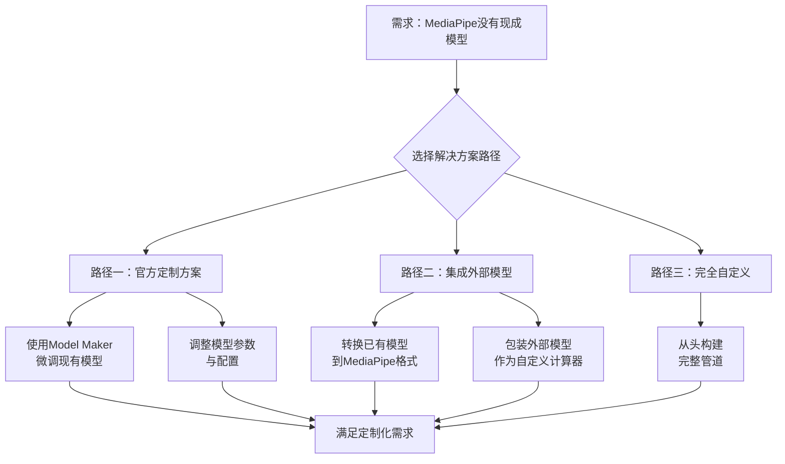

好的，MediaPipe 是一个非常强大且流行的开源框架。简单来说，它的核心使命是：

**让计算机能够“看懂”和“理解”现实世界中的视觉和听觉数据。**

你可以把它想象成给计算机安装的**“眼睛”和“耳朵”**，并且它还自带了一个处理这些信号的**“大脑”**。

---

### 一、核心是什么？

MediaPipe 是一个由 **Google 开发**的跨平台框架，主要用于构建**多模态（如视频、音频、传感器时间序列数据）应用的机器学习管道**。

它的关键在于提供了一个**可重用的组件库**，开发者可以像搭积木一样，快速组合出复杂的感知应用。

---

### 二、它主要能做什么？（核心应用领域）

MediaPipe 提供了一系列现成的“解决方案”，覆盖了最常见的感知任务：

#### 1. **人手与手势识别**
- **功能**：精准识别手部的21个关键点（关节）。
- **应用**：手势控制、手语翻译、虚拟现实交互、乐器模拟。
- **例子**：你用手比个“耶”，它能识别出来；你动动手指，可以在空中弹奏虚拟钢琴。

#### 2. **人脸与面部特征检测**
- **功能**：检测人脸，并定位468个3D面部网格点。
- **应用**：美颜/滤镜（如虚拟眼镜、胡子）、虚拟试妆、面部动作捕捉、注意力检测（如判断司机是否疲劳）。
- **例子**：Snapchat、Instagram那些好玩的AR滤镜，底层技术就和这个类似。

#### 3. **人体姿态估计**
- **功能**：实时检测人体的33个关键点（头、肩、肘、膝、脚踝等）。
- **应用**：健身动作矫正、舞蹈游戏、动画驱动、安防监控。
- **例子**：一些健身APP可以告诉你深蹲的姿势是否标准，就是通过分析你的关节角度。

#### 4. **人体全身分割**
- **功能**：将图像中的人物像素从背景中精确地分离出来。
- **应用**：视频会议虚拟背景、影视特效、背景虚化。
- **例子**：Zoom的虚拟背景功能，更高级的版本就是用了这种技术。

#### 5. **物体检测与跟踪**
- **功能**：识别图像或视频中有什么物体，并持续跟踪它们。
- **应用**：智能零售（统计客流量）、工业质检、无人机避障。

#### 6. **语音识别与音频处理**
- **功能**：将语音转为文字，或分析音频属性。
- **应用**：语音助手、实时字幕生成。

---

### 三、为什么它如此受欢迎？（核心优势）

#### 1. **跨平台能力极强**
   - **一次开发，到处部署**：同一套代码可以运行在 **Android, iOS, Web/JavaScript, 桌面（Windows/macOS/Linux）甚至嵌入式设备（如树莓派）** 上。这是它最大的杀手锏之一。

#### 2. **性能卓越，实时性强**
   - 针对移动设备和边缘计算进行了大量优化，即使在手机上也能够实现**高帧率（如30fps以上）** 的实时处理。

#### 3. **即拿即用，降低门槛**
   - 提供了大量**预训练好的模型和现成的解决方案**。即使你不懂深度学习模型内部的复杂原理，也能通过几行代码调用强大的感知功能。
   - **极大地加速了原型开发和应用上线**。

#### 4. **专注于端侧（On-Device）AI**
   - 处理数据在本地设备上完成，**不需要上传到云端**。
   - **好处**：
     - **保护隐私**：你的视频、音频数据不会离开你的手机。
     - **低延迟**：因为没有网络传输的延迟，反应更快。
     - **离线可用**：在没有网络的环境下也能正常工作。

---

### 四、一个生动的比喻

如果把开发一个AI视觉应用比作**做一道复杂的菜（比如佛跳墙）**：

- **传统方式**：你需要从种菜、养猪开始，自己准备所有原材料（收集数据），自己研究菜谱和火候（训练模型），最后才能开始烹饪，过程极其繁琐。
- **使用MediaPipe**：就像走进了一家**顶级预制菜超市**。里面已经为你准备好了熬制好的高汤、处理好的鲍鱼海参（预训练模型）、标准的烹饪流程（优化过的管道）。你只需要按照简单的说明把它们组合加热一下，就能快速做出一道美味佳肴。

---

### 五、典型应用场景

1. **AR/VR应用**：虚拟试穿、AR游戏交互。
2. **健身与健康**：AI健身教练、瑜伽姿势矫正、康复训练指导。
3. **人机交互**：手势控制的智能家居、体感游戏。
4. **内容创作**：短视频特效、虚拟主播、智能剪辑。
5. **无障碍技术**：手语实时翻译成文字。

### 总结

| 方面 | 描述 |
| :--- | :--- |
| **它是什么** | 一个用于**多媒体机器学习应用**的**跨平台框架** |
| **核心价值** | 提供**高性能、实时的感知能力**，并**极大降低开发难度** |
| **关键特性** | **跨平台、即用型解决方案、端侧处理、开源免费** |
| **竞争对手** | Apple的Core ML, Microsoft的ONNX Runtime等，但MediaPipe在跨平台和解决方案完整性上优势明显 |

简单来说，**MediaPipe 让任何开发者都能轻松地给自己的应用赋予“看”和“听”的智能能力**，是推动AI技术普及到千万应用中的重要桥梁。


这是一个非常实际且重要的问题！当MediaPipe官方提供的现成模型无法满足你的特定需求时，你有多种强大的选择。MediaPipe不仅仅是一个“模型商店”，更是一个**强大的框架**。

---

### 一、MediaPipe的核心能力：不止是现成模型

首先，要明白MediaPipe提供的两种不同层次的解决方案：

1. **预构建方案**：开箱即用的完整功能（如手部识别、姿态检测）
2. **框架能力**：构建自定义机器学习管道的工具集

当没有现成模型时，你可以利用MediaPipe的**框架能力**来自定义开发。

---

### 二、解决方案路线图

根据你的具体需求和技术资源，可以选择不同层次的解决方案：



---

### 三、具体解决方案详解

#### 方案1：使用Model Maker工具（微调现有模型）

这是**最推荐、最高效**的方法。

**适用场景**：MediaPipe有相关模型，但需要适应你的特定数据。
- 比如：手部识别模型，但你想专门识别**手语手势**
- 比如：物体检测模型，但你想检测**特定工业零件**

**具体做法**：
```python
# 示例：微调手势识别模型来识别自定义手势
import mediapipe as mp
from mediapipe.model_maker import gesture_classifier

# 1. 准备你的自定义手势数据
data = gesture_classifier.Dataset.from_folder(
    dirname='my_custom_gestures/'
)

# 2. 基于MediaPipe现有模型进行微调
model = gesture_classifier.GestureClassifier.create(
    data=data,
    base_model='hand_landmarker.task'  # 基于手部关键点模型
)

# 3. 导出为MediaPipe格式
model.export_model('my_custom_gesture_classifier.task')
```

#### 方案2：集成外部模型到MediaPipe

**适用场景**：你有在其他框架（TensorFlow、PyTorch）中训练好的模型。

**步骤**：
1. **模型转换**：将模型转换为TFLite格式
2. **创建自定义计算器**：编写C++代码将模型集成到MediaPipe管道中

**示例架构**：
```cpp
// 自定义计算器示例
class MyCustomModelCalculator : public CalculatorBase {
 public:
  static absl::Status GetContract(CalculatorContract* cc);
  absl::Status Open(CalculatorContext* cc) override;
  absl::Status Process(CalculatorContext* cc) override;
  
 private:
  std::unique_ptr<tflite::Interpreter> interpreter_;
};
```

#### 方案3：完全自定义管道

**适用场景**：需要全新的计算机视觉或音频处理流程。

**你可以构建**：
- **多模型串联**：手部识别 + 手势分类 + 动作时序分析
- **混合处理管道**：视频输入 → 人脸检测 → 情感分析 → 语音合成
- **特定领域应用**：医疗影像分析、工业质检等

---

### 四、实际案例：构建一个"厨师手势识别系统"

假设MediaPipe没有现成的厨师手势模型：

```python
# 伪代码：自定义厨师手势识别管道
import mediapipe as mp
from mediapipe import tasks
from mediapipe.tasks import python

# 1. 使用手部关键点作为基础
base_options = python.BaseOptions(model_asset_path='hand_landmarker.task')

# 2. 添加自定义手势分类器
custom_options = {
    'custom_gesture_model': 'chef_gestures.tflite',
    'gesture_categories': ['chop', 'stir', 'slice', 'knead']
}

# 3. 创建自定义管道
with python.vision.GestureRecognizer.create_from_options(
    base_options, custom_options) as recognizer:
    
    # 4. 处理视频流
    result = recognizer.recognize(video_frame)
    if result.gestures:
        print(f"检测到手势: {result.gestures[0][0].category_name}")
```

---

### 五、技术栈选择指南

根据你的需求选择合适的技术路径：

| 你的需求 | 推荐方案 | 技术难度 | 开发时间 |
|---------|----------|----------|----------|
| **小范围定制** | Model Maker微调 | ⭐⭐ | 几天 |
| **集成现有模型** | 模型转换 + 自定义计算器 | ⭐⭐⭐ | 1-2周 |
| **全新功能** | 完全自定义管道 | ⭐⭐⭐⭐⭐ | 1个月+ |
| **研究原型** | 纯Python + MediaPipe Python API | ⭐⭐ | 几天 |

---

### 六、资源和支持

1. **官方文档**：MediaPipe Customization Guide
2. **示例代码**：GitHub上的custom calculator示例
3. **社区支持**：MediaPipe Discord频道和GitHub Discussions
4. **预训练基础模型**：MediaPipe Model Zoo

---

### 总结

**MediaPipe的真正威力在于其框架能力，而不仅仅是预构建模型。**

当没有现成模型时：
1. **首选微调**：用Model Maker适配现有模型
2. **次选集成**：将外部模型转换集成
3. **终极方案**：完全自定义管道

记住：MediaPipe的核心价值是提供了一套**构建、优化和部署多媒体机器学习管道的标准化方法**，这比任何一个单独的模型都要强大得多！

你的具体需求是什么？我可以帮你设计更具体的解决方案。