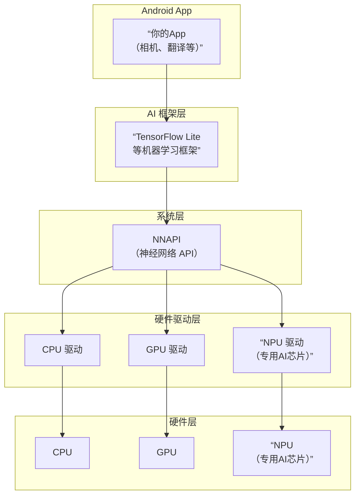

好的，这是一个关于 NNAPI 的详细解释。

### 一句话概括

**NNAPI** 是 **Android 系统上的一个底层 API**，它允许人工智能框架（如 TensorFlow Lite）利用设备上的专用硬件（如 GPU、DSP、NPU）来高效地运行机器学习模型，从而加快运算速度并降低功耗。

---

### 详细解释

#### 1. 它是什么？

*   **全称**： Neural Networks API，即神经网络 API。
*   **角色**： 它是一个连接上层 AI 应用/框架和底层硬件驱动程序的“桥梁”或“中间人”。
*   **目标**： 解决 Android 设备硬件碎片化问题，为机器学习推理提供一个统一、高效的硬件加速方案。

#### 2. 为什么需要 NNAPI？

在没有 NNAPI 之前，AI 应用想要使用硬件加速，需要为不同芯片厂商（高通、联发科、华为等）的不同硬件（GPU、DSP）分别编写代码，非常复杂且难以维护。

NNAPI 的出现解决了这个问题：
*   **对应用开发者**： 你只需要使用统一的 NNAPI 接口，无需关心用户手机用的是哪种芯片。NNAPI 会自动将计算任务分配给当前设备上可用的、性能最强的硬件来处理。
*   **对硬件厂商**： 他们只需要为自己的硬件（NPU、DSP等）开发一个符合 NNAPI 标准的驱动程序即可。一旦驱动完成，所有支持 NNAPI 的 AI 应用都能自动使用他们的硬件。

#### 3. 它是如何工作的？

它的工作流程可以概括为以下几个步骤：

1.  **模型加载**： 你的 App 通过 TensorFlow Lite 等高级框架，将预训练好的机器学习模型（例如，一个图像识别模型）传入。
2.  **请求 NNAPI**： TensorFlow Lite 会判断是否使用硬件加速。如果决定使用，它会将模型的计算图和相关数据传递给 NNAPI 运行时。
3. **驱动分配**： NNAPI 运行时接收到任务后，会查询设备上所有可用的硬件驱动程序（CPU、GPU、DSP、NPU 等）。
4. **执行与反馈**： NNAPI 将计算任务分割，并调度到最合适的硬件上执行。最后，将计算结果返回给上层的 TensorFlow Lite，再传回给你的 App。

下图清晰地展示了 NNAPI 在 Android 系统中的位置和作用：

#### 4. 主要特点和优势

*   **硬件加速**： 充分利用专用硬件的并行计算能力，比纯 CPU 运算快数倍甚至数十倍。
*   **低功耗**： 专用的 AI 处理器（NPU）为 AI 任务优化，能效比远高于 CPU 和 GPU。
*   **统一接口**： 简化了开发流程，实现了“一次编写，处处加速”。
*   **向后兼容**： 如果设备没有专用的 AI 硬件，NNAPI 会自动回退到使用 CPU 执行任务，保证功能的可用性。

#### 5. 谁在使用它？

普通用户不会直接使用 NNAPI，但你每天都在享受它带来的好处。使用 NNAPI 的典型场景包括：

*   **手机相机**： 人像模式、夜景模式、HDR 处理。
*   **语音助手**： 本地语音识别和唤醒。
*   **翻译应用**： 实时文字翻译。
*   **图像处理应用**： 风格迁移、超分辨率等。
*   **任何需要在手机本地快速、低耗地运行 AI 模型的 App**。

---

### 总结

**NNAPI 是 Android 生态系统中实现高效、普惠的终端侧 AI 的关键基石。** 它让 App 开发者能轻松地为亿万用户提供流畅、省电的 AI 功能，同时推动了移动端 AI 硬件的创新和发展。

简单来说，你可以把它理解为 **Android 系统上的“AI 图形驱动程序”**，就像 OpenGL/Vulkan 为游戏统一调用图形硬件一样，NNAPI 为 AI 应用统一调用 AI 计算硬件。

这是一个非常好的观察，也是在实际部署中经常遇到的典型问题！你遇到的 **MobileNet 加速而 EfficientNet 减速** 的情况，背后有深刻的原因。

简单来说，核心原因是：**NNAPI 的硬件加速并非万能，它对于特定类型的算子、计算图结构以及内存访问模式有很高的要求。** EfficientNet 的模型特性导致它在很多硬件上难以被高效加速。

下面我们来详细拆解原因：

### 1. 模型复杂度和算子支持

*   **MobileNet**：
    *   **核心结构**： 大量使用 **深度可分离卷积**。这是一个将标准卷积分解为两步的轻量级操作。
    *   **NNAPI 支持**： 深度可分离卷积是移动端模型的“明星算子”，所有支持 NNAPI 的硬件厂商（高通、联发科等）都会为其做极致的优化。对于硬件来说，这是一个已知的、规则的计算模式，很容易在 DSP/NPU 上并行化。
    *   **结果**： NNAPI 可以非常高效地将整个模型或大部分计算图下发到硬件执行，避免了在 CPU 和加速器之间来回拷贝数据，因此加速效果明显。

*   **EfficientNet**：
    *   **核心结构**： 基于 **MobileNetV3** 和 **MnasNet**，但引入了更复杂的模块，如 **带压缩激励的 MBConv 模块**。它包含了：
        *   深度可分离卷积
        *   压缩激励模块（全连接层和激活函数）
        *   更多的跳跃连接
        *   更复杂的激活函数（如 Swish/SiLU）
    *   **NNAPI 支持**：
        *   **算子碎片化**： SE 模块中的全连接层、以及 Swish 激活函数等，可能不是所有硬件都完美支持。如果模型中有一个算子不被硬件驱动支持，NNAPI 就可能发生 **“回退”**。
        *   **图分割**： 为了支持不完整的算子，NNAPI 驱动可能会将整个计算图切割成多个子图。一部分在 NPU/DSP 上运行，另一部分则需要在 CPU 上运行。**频繁地在 CPU 和加速器之间切换和传输数据，会产生巨大的开销**，这个开销有时甚至会超过加速本身带来的收益。

### 2. 计算与内存访问比

*   **卷积类操作**（尤其是大尺寸卷积）是 **计算密集型** 任务。硬件加速器（NPU/DSP）有大量的计算单元，擅长处理这类任务，可以掩盖内存访问的延迟。
*   **EfficientNet 中的一些操作**（如 SE 模块中的全连接层、元素级操作）可能是 **内存密集型** 的。它们计算量不大，但需要频繁地从内存中读取和写入数据。
*   **问题所在**： 对于内存密集型操作，**性能瓶颈在于内存带宽，而不是计算能力**。NPU/DSP 的强大算力在这里无用武之地。而将数据从系统内存传输到加速器内存本身就有成本，这个成本可能比在 CPU 上直接计算还要高。

### 3. 数据精度和量化

*   很多硬件加速器为了追求极致的性能和能效，会使用比 FP32 更低的精度进行计算，例如 **FP16**、**INT8** 甚至 **INT4**。
*   **MobileNet** 通常被设计为易于量化的模型，在 INT8 精度下性能损失很小。
*   **EfficientNet** 由于其结构的复杂性（如 SE 模块），可能对量化更敏感。如果你使用的是 FP32 模型，而硬件加速器主要优化了 INT8 路径，那么它可能无法充分发挥性能，或者需要在线进行精度转换，带来额外开销。

### 4. 硬件驱动优化程度

硬件厂商的驱动优化是有优先级的。他们会优先为最流行、使用最广泛的模型（如 MobileNet, ResNet）做深度优化。EfficientNet 虽然精度高，但相对更“新”也更复杂，可能不是所有设备上的驱动都为其做了“贴身”优化。

---

### 总结与建议

**为什么 EfficientNet 在 NNAPI 下反而减速？**

根本原因在于 **模型复杂性和硬件支持不匹配** 导致的 **调度开销**。

1.  **图分割**： NNAPI 驱动无法将整个 EfficientNet 模型放到 NPU 上执行，只能切成多块。
2.  **频繁数据搬运**： 模型的一部分在 NPU 上算，另一部分在 CPU 上算，导致数据需要在两者之间来回拷贝。
3.  **开销大于收益**： 数据搬运和同步等待的时间，远远超过了在 NPU 上计算那部分子图所节省的时间。

**你可以怎么做？**

1.  **检查回退情况**： 使用 Android Studio 的 **System Trace** 或 `adb shell dumpsys package dumpsys package nnapi` 等工具，来分析 NNAPI 运行时到底是如何分配你的模型的，看看有多少算子被 fallback 到了 CPU。
2.  **尝试量化模型**： 将你的 EfficientNet 模型转换为 **INT8 量化版本**。绝大多数硬件对 INT8 的优化是最好的，而且这也能减少内存带宽压力。这可能是提升速度最有效的方法。
3.  **模型选择**： 在移动端，**模型精度和推理速度需要权衡**。如果 EfficientNet 在目标设备上无法有效加速，可以考虑使用同样精度下更“友好”的模型，如 **MobileNetV3** 或其变种。
4.  **分设备策略**： 在你的 App 中，可以做一个简单的设备性能检测，对于高端设备尝试使用 EfficientNet，对于中低端设备则默认使用 MobileNet。

你的这个发现非常重要，它揭示了移动端 AI 部署的一个核心原则：**理论计算量（FLOPs）不等于实际推理速度，部署环境（硬件、驱动、框架）的影响至关重要。**